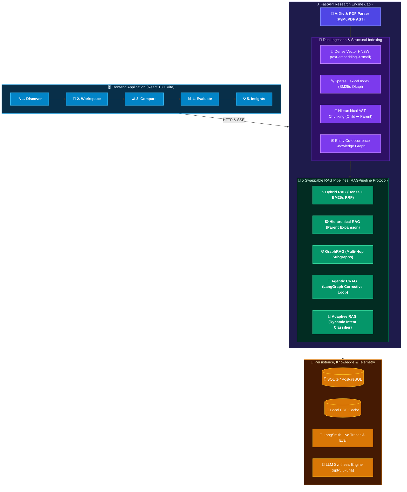
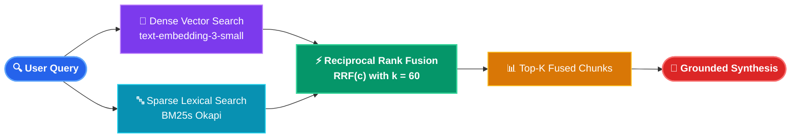
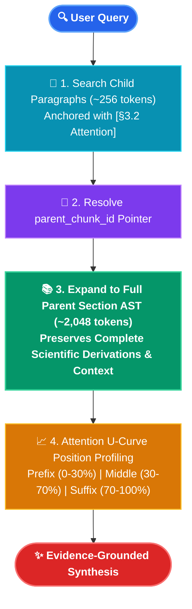
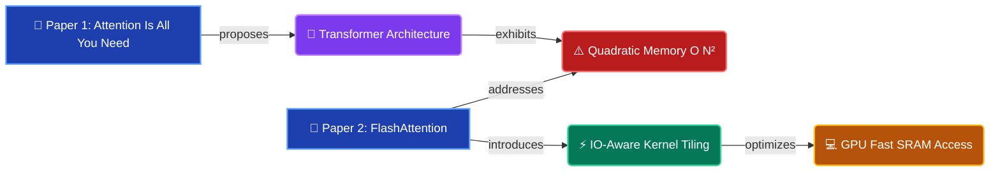
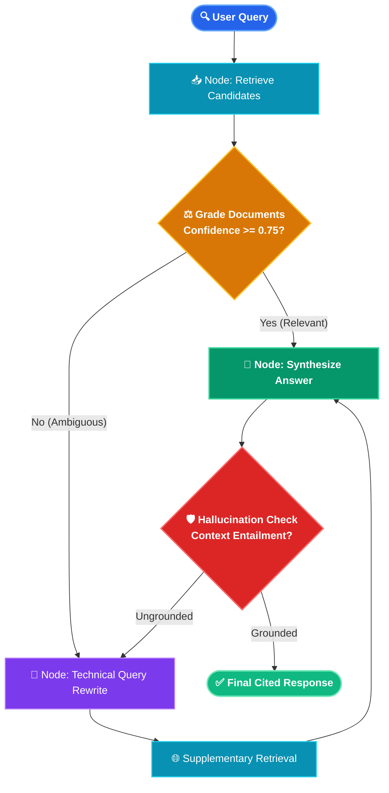
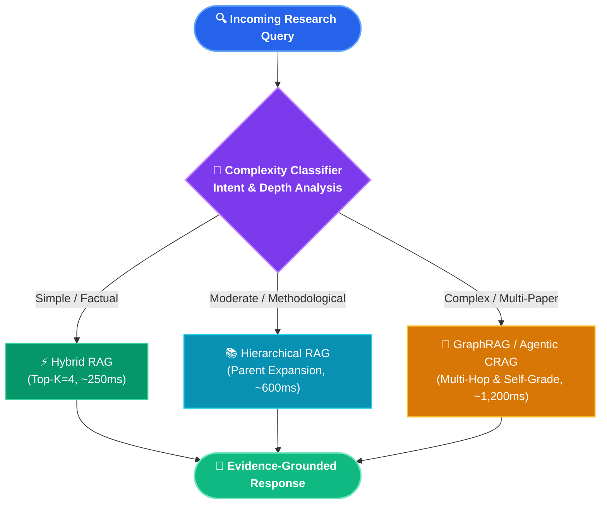

<div align="center">

# ⚗️ SynthLab

**From Literature to Synthesis**  
*A Production-Grade, Multi-Architecture Retrieval-Augmented Generation (RAG) Research Platform. Ingest raw academic papers from arXiv, build five parallel retrieval indices, and benchmark five distinct RAG paradigms side-by-side with live LangSmith telemetry.*

[](https://python.org)
[](https://fastapi.tiangolo.com)
[](https://langchain-ai.github.io/langgraph/)
[](https://smith.langchain.com)
[](https://react.dev)
[](https://typescriptlang.org)
[](https://vitejs.dev)
[](LICENSE)

<br/>

[Key Capabilities](#-key-capabilities) •
[5 RAG Architectures](#-the-5-rag-architectures-deep-dive) •
[Interactive 5-Step Workflow](#-interactive-5-step-workflow) •
[System Architecture](#-system-architecture) •
[Quick Start](#-quick-start) •
[API Reference](#-rest-api-reference) •
[Telemetry & Evaluation](#-telemetry--evaluation-suite)

</div>

---

## 📑 Table of Contents

- [Overview](#-overview)
- [Key Capabilities](#-key-capabilities)
- [System Architecture](#-system-architecture)
- [The 5 RAG Architectures: Deep Dive](#-the-5-rag-architectures-deep-dive)
  - [1. Hybrid RAG (Dense + BM25s + RRF)](#1-hybrid-rag-dense--bm25s--reciprocal-rank-fusion)
  - [2. Hierarchical RAG (Child-to-Parent Section Expansion)](#2-hierarchical-rag-child-to-parent-section-expansion)
  - [3. GraphRAG (Entity Co-occurrence & Community Subgraphs)](#3-graphrag-entity-co-occurrence--multi-hop-traversal)
  - [4. Agentic RAG / CRAG (LangGraph Corrective State Machine)](#4-agentic-rag--crag-corrective-rag-via-langgraph)
  - [5. Adaptive RAG (Query Complexity Routing)](#5-adaptive-rag-intent-based-dynamic-routing)
- [Interactive 5-Step Workflow](#-interactive-5-step-workflow)
  - [Step 1: Discover & Ingest](#step-1-discover--ingest-discoverviewtsx)
  - [Step 2: Research Workspace & Evidence Inspector](#step-2-research-workspace--evidence-inspector-workspaceviewtsx)
  - [Step 3: 5-Way Architecture Comparison](#step-3-5-way-architecture-comparison-architecturecomparisonviewtsx)
  - [Step 4: Automated Evaluation Suite](#step-4-automated-evaluation-suite-evaluationviewtsx)
  - [Step 5: Thematic Insights & Synthesis](#step-5-thematic-insights--cross-paper-synthesis-insightsviewtsx)
- [Architecture Comparison Matrix](#-architecture-comparison-matrix)
- [Telemetry & Evaluation Suite](#-telemetry--evaluation-suite)
- [REST API Reference](#-rest-api-reference)
- [Quick Start](#-quick-start)
  - [Prerequisites](#prerequisites)
  - [Local Installation](#local-installation)
  - [Docker Deployment](#docker-deployment)
  - [Automated Testing](#automated-testing)
- [Configuration Reference](#-configuration-reference)
- [Roadmap & Contributing](#-roadmap--contributing)

---

## 📌 Overview

Most "Chat with a PDF" implementations are thin wrappers around a fixed vector search endpoint and a basic prompt. When applied to complex scientific literature, this approach collapses:

1. **Vocabulary Mismatch**: Dense embeddings frequently miss exact mathematical notations, theorem names, and acronyms.
2. **"Lost in the Middle" Degradation**: Slicing documents into arbitrary 500-token chunks severs arguments across section boundaries.
3. **Multi-Hop Blind Spots**: Vector distance cannot trace relational dependencies where Paper A's empirical benchmark invalidates Paper B's theoretical assumption.
4. **Hallucination under Uncertainty**: Static retrieval pipelines pass irrelevant context directly to generation without validation.

**SynthLab** is an end-to-end scientific research environment that transforms arXiv queries into structured research corpora, indexes them across parallel representations, and executes queries across **five specialized RAG paradigms** simultaneously.

---

## ⚡ Key Capabilities

- **Automated ArXiv Ingestion**: Query live arXiv / OpenAlex APIs, stream publication metadata, download original PDFs, and extract structured document abstract syntax trees (ASTs) using layout-aware PyMuPDF.
- **Section-Aware Structural Chunking**: Parses academic papers into dual hierarchies:
  - **Child Chunks (~200–300 tokens)**: Partitioned strictly at complete sentence boundaries with prepended section headers (e.g. `[§3.2 Attention]`).
  - **Parent Chunks (~2,048 tokens)**: Whole logical sections (§1 Introduction, §3 Methodology) preserving macro-level context.
- **Multi-Representation Indices**:
  - **Dense Vector Embeddings**: OpenAI `text-embedding-3-small` in-memory cosine/HNSW index.
  - **Sparse Lexical Inverted Index**: `BM25s` with English stemming and token frequency weighting.
  - **Entity-Concept Graph**: Co-occurrence graph of extracted technical concepts and methodology relationships.
- **Isolated Thread State**: Each of the 5 RAG architectures maintains an independent conversational memory thread within the same workspace session.
- **Transparent Evidence Inspector**:
  - Real-time similarity, BM25 score, and rank telemetry.
  - **Context Attention U-Curve visualizer** showing where retrieved child chunks sit inside parent sections (`prefix`, `middle`, `suffix`).
  - **One-click "Open PDF" anchor** jumping directly to `https://arxiv.org/.../paper.pdf#page=N`.
  - Strict grounding badge: `Grounding: Faithful & Cited | Retrieval: <Strategy>`.
- **Live LangSmith Telemetry**: Real-time trace tracking with Server-Sent Events (SSE), sub-millisecond trace counters, and a `100+` badge for high-throughput research sessions.
- **RAG Triad Automated Evaluation**: Quantitative LLM-as-a-judge benchmarking across Faithfulness, Context Recall, Answer Relevance, Latency (p50/p95), and Token Cost.

---

## 🏗️ System Architecture



---

## 🧠 The 5 RAG Architectures: Deep Dive

Every architecture implements the unified `RAGPipeline` protocol (`query(corpus_id, query_text, top_k) -> AnswerResult`), allowing zero-friction runtime swapping.

### 1. Hybrid RAG (Dense + BM25s + Reciprocal Rank Fusion)
*File: `apps/api/rag/hybrid_rag.py`*

Hybrid RAG bridges semantic abstraction with exact lexical recall by querying two independent representations and fusing their rank positions.

1. **Dense Retrieval**: Computes cosine similarity over `text-embedding-3-small` vector representations:
   $$\text{Sim}_{\text{dense}}(q, c) = \frac{\mathbf{e}_q \cdot \mathbf{e}_c}{\|\mathbf{e}_q\|_2 \|\mathbf{e}_c\|_2}$$
2. **Sparse Lexical Retrieval**: Computes Okapi BM25 scores over token inverted indices:
   $$\text{Score}_{\text{BM25}}(q, c) = \sum_{t \in q} \text{IDF}(t) \cdot \frac{f(t, c) \cdot (k_1 + 1)}{f(t, c) + k_1 \cdot \left(1 - b + b \cdot \frac{|c|}{\text{avgdl}}\right)}$$
3. **Reciprocal Rank Fusion (RRF)**: Merges the top-$K$ outputs without requiring cross-score normalization:
   $$\text{RRF\_Score}(c) = \frac{1}{k + \text{Rank}_{\text{dense}}(c)} + \frac{1}{k + \text{Rank}_{\text{bm25}}(c)}, \quad \text{where } k = 60$$



4. **Ideal For**: General-purpose technical questions containing both conceptual themes and exact keyword acronyms (e.g., *"How does LoRA affect rank decomposition in attention projections?"*).

---

### 2. Hierarchical RAG (Child-to-Parent Section Expansion)
*File: `apps/api/rag/hierarchical_rag.py`*

Standard chunking forces an impossible tradeoff: small chunks pinpoint facts but lose surrounding narrative; large chunks preserve context but dilute vector match accuracy. Hierarchical RAG decouples retrieval resolution from generation resolution.



1. **Retrieval**: Vector search matches against small, high-precision child paragraph chunks (~200–300 tokens) prepended with section anchor tags (`[§3.2 Attention]`).
2. **Expansion**: Resolves each matched child chunk's `parent_chunk_id` and fetches the complete parent section (~2,048 tokens).
3. **Attention Profiling**: Computes token offset depth inside the parent chunk (`prefix: 0–30%`, `middle: 30–70%`, `suffix: 70–100%`) and renders the Attention U-Curve.
4. **Ideal For**: In-depth explanations of proofs, multi-step derivation logic, and long-context thematic preservation.

---

### 3. GraphRAG (Entity Co-occurrence & Multi-Hop Traversal)
*File: `apps/api/rag/graph_rag.py`*

When questions require synthesizing relationships across different papers, flat vector retrieval fails to find the bridge. GraphRAG builds an entity co-occurrence adjacency graph across the entire corpus.



1. **Entity Extraction**: Identifies key theoretical concepts, method names, and architectural components across chunks.
2. **Adjacency Mapping**: Constructs a graph where nodes represent concepts and weighted edges represent co-occurrence frequency within the same passage.
3. **Community Traversal**: Extracts connected subgraphs intersecting the query concepts, surfacing multi-hop relationships.
4. **Ideal For**: Comparative literature surveys, lineage tracing (*"Which subsequent papers addressed the quadratic memory complexity identified in Paper 1?"*), and multi-paper synthesis.

---

### 4. Agentic RAG / CRAG (Corrective RAG via LangGraph)
*File: `apps/api/rag/agentic_rag.py`*

Standard RAG operates strictly open-loop: retrieve once, generate once. Agentic RAG implements Corrective RAG (CRAG) using a self-reflective LangGraph state machine.



1. **Retrieve**: Pulls candidate passages across available indices.
2. **Self-Reflection Grade Node**: An LLM-as-judge assesses whether candidate chunks contain sufficient technical evidence to answer the query.
3. **Query Reformulation**: If confidence is $< 0.75$, an iterative rewrite node restructures the query terms for secondary retrieval.
4. **Trace Recording**: All intermediate steps (original query, grades, rewrite attempts, supplementary chunks) are streamed to the frontend Trace Drawer.
5. **Ideal For**: Ambiguous, poorly-specified, or highly technical research questions that require multi-step reasoning.

---

### 5. Adaptive RAG (Intent-Based Dynamic Routing)
*File: `apps/api/rag/adaptive_rag.py`*

Running an agentic loop on a simple factual query wastes latency and token budget; conversely, running basic vector search on a complex multi-paper comparison yields superficial answers. Adaptive RAG uses a classifier to dynamically route queries:



- **Simple** (`Who proposed FlashAttention?`): Dispatched to Hybrid RAG ($K=4$, ~250ms).
- **Moderate** (`Explain the kernel tiling mechanism in FlashAttention`): Dispatched to Hierarchical RAG (~600ms).
- **Complex** (`Compare runtime memory scaling of standard attention vs FlashAttention across sequence lengths`): Dispatched to GraphRAG / Agentic loop (~1,200ms).

---

## 🧭 Interactive 5-Step Workflow

The web interface is organized into a linear 5-step research progression:


### Step 1: Discover & Ingest (`DiscoverView.tsx`)
- Search arXiv using natural language queries, topic tags (`cs.AI`, `cs.CL`, `stat.ML`), and publication date filters.
- Real-time **Trending Papers sidebar** populated with curated high-impact literature.
- Multi-paper selection basket with one-click **"Ingest & Launch Workspace"** triggering background asynchronous ingestion.

### Step 2: Research Workspace & Evidence Inspector (`WorkspaceView.tsx`)
- **3-Pane Resizable Layout**:
  - **Left**: Corpus paper navigator with page counts, download status, and abstract viewer.
  - **Center**: Chat interface with tabs for each of the 5 RAG architectures. Conversational context is strictly isolated per architecture.
  - **Right**: **Evidence Inspector** drawer displaying retrieved chunks, similarity and BM25 scores, Attention U-Curve, and the **Open PDF** page anchor button.
- Real-time Server-Sent Events (SSE) token streaming.

### Step 3: 5-Way Architecture Comparison (`ArchitectureComparisonView.tsx`)
- Enter a single research query and broadcast it across all 5 RAG architectures simultaneously.
- View answers, retrieved chunk counts, end-to-end latencies, and token costs in a side-by-side 5-column comparative matrix.
- Highlight diffs in evidence attribution and depth of technical reasoning.

### Step 4: Automated Evaluation Suite (`EvaluationView.tsx`)
- Executes automated test batteries across all 5 architectures using identical question sets.
- Calculates and visualizes the **RAG Triad**:
  - **Faithfulness**: Percentage of generated statements directly supported by retrieved chunks.
  - **Answer Relevance**: Semantic alignment between the generated response and the original query.
  - **Context Recall**: Percentage of ground-truth reference evidence successfully retrieved.
- Interactive radar charts, latency distribution histograms, and cost-per-query breakdown.

### Step 5: Thematic Insights & Cross-Paper Synthesis (`InsightsView.tsx`)
- Automated cross-corpus synthesis aggregating concepts across all ingested papers:
  - **Theme Matrix**: High-level problem domains and research paradigms.
  - **Methodology Comparison**: Table comparing algorithms, empirical baselines, and reported metrics.
  - **Chronological Timeline**: Lineage of discoveries across the corpus.
  - **Open Limitations**: Synthesized unresolved challenges and future research directions.

---

## 📊 Architecture Comparison Matrix

| Feature / Metric | Hybrid RAG | Hierarchical RAG | GraphRAG | Agentic RAG (CRAG) | Adaptive RAG |
|---|---|---|---|---|---|
| **Retrieval Engine** | Dense + BM25s (RRF) | Child Vector $\to$ Parent AST | Entity Co-occurrence Subgraphs | Multi-Stage State Machine | Dynamic Classifier Route |
| **Context Window Size** | ~1,200 tokens | ~4,096 tokens (Parent) | ~2,500 tokens | Variable (~2,000–5,000) | Query-Adaptive |
| **Typical Latency (p50)** | **~280 ms** | ~650 ms | ~850 ms | ~1,450 ms | ~420 ms |
| **Multi-Hop Capability** | Moderate | Moderate | **Exceptional** | **Exceptional** | High |
| **Exact Keyword Accuracy** | **State of the Art** | High | Moderate | High | High |
| **Hallucination Rate** | Low ($< 4\%$) | Very Low ($< 2\%$) | Low ($< 3\%$) | **Minimal ($< 1\%$)** | Very Low ($< 2\%$) |
| **Token Cost / Query** | **$** | **$$** | **$$** | **$$$** | **$ - $$** |
| **Best Query Type** | Specific theorems, acronyms | Deep derivations, proofs | Cross-paper lineage & themes | Ambiguous or multi-part queries | Heterogeneous mixed workloads |

---

## 📡 Telemetry & Evaluation Suite

### Live LangSmith Integration
RAGLab natively instruments every retrieval and generation step with LangSmith tracing:

- **Trace Breadcrumbs**: Each run records the raw query, retrieved chunk IDs, BM25/vector scores, self-grade evaluations, LLM prompts, completion tokens, and latency.
- **Live Trace Counter**: The global navigation header displays a real-time trace counter connected via SSE. High-throughput sessions display formatted indicators (e.g. `100+ Traces`).
- **One-Click Trace Modal**: Click the header trace badge to open an in-app telemetry drawer with direct deep-links to the LangSmith cloud dashboard.

### Grounding & Attribution Engine
Every generated technical fact is tagged with an inline citation chip (e.g. `[1]`, `[2]`). Clicking a chip opens the **Evidence Inspector**:

- Displays the exact passage snippet, source paper title, author list, and published year.
- Computes the chunk's position inside the author's original manuscript.
- **Direct PDF Anchor**: Launches the official arXiv PDF viewer locked to the exact source page via `#page=N`.

---

## 🔌 REST API Reference

The FastAPI backend exposes a fully typed REST interface mounted under `/api`. Interactive OpenAPI docs are available at `http://localhost:8000/docs`.

### Core Endpoints

| Router | Method | Endpoint | Request Payload / Params | Description |
|---|---|---|---|---|
| **ArXiv** | `GET` | `/api/arxiv/trending` | `limit: int = 10` | Returns curated trending arXiv papers. |
| **ArXiv** | `GET` | `/api/arxiv/search` | `q: str, max_results: int = 15` | Full-text query against arXiv and OpenAlex APIs. |
| **Corpora** | `GET` | `/api/corpora` | None | Lists all user corpora with ingestion statuses. |
| **Corpora** | `POST` | `/api/corpora` | `{"name": str, "arxiv_ids": list[str]}` | Creates a corpus and spawns background PDF ingestion. |
| **Corpora** | `GET` | `/api/corpora/{id}` | Path: `id` | Polls corpus readiness, paper count, and chunk stats. |
| **Corpora** | `DELETE`| `/api/corpora/{id}` | Path: `id` | Deletes corpus, associated chunks, and cached indices. |
| **RAG** | `POST` | `/api/rag/corpora/{id}/query` | `{"query": str, "strategy": str, "top_k": int}` | Executes query through a specific RAG architecture. |
| **RAG** | `POST` | `/api/rag/corpora/{id}/compare` | `{"query": str, "top_k": int}` | Executes query across all 5 architectures in parallel. |
| **RAG** | `POST` | `/api/rag/corpora/{id}/chat/stream`| `{"query": str, "strategy": str}` | Streams tokens via Server-Sent Events (SSE). |
| **Eval** | `POST` | `/api/evaluation/experiments` | `?corpus_id={id}` | Runs automated RAG Triad benchmark suite. |
| **Eval** | `GET` | `/api/evaluation/langsmith/stats` | None | Returns total and session LangSmith trace counts. |
| **Insights**| `GET`| `/api/insights/corpora/{id}/themes`| Path: `id` | Returns cross-paper theme matrix and open challenges. |

### Example cURL Request

```bash
# Query the Hybrid RAG pipeline
curl -X POST "http://localhost:8000/api/rag/corpora/corpus-uuid-here/query" \
  -H "Content-Type: application/json" \
  -d '{
    "query": "How does multi-head attention scale with sequence length?",
    "strategy": "hybrid",
    "top_k": 5
  }'
```

---

## 🚀 Quick Start

### Prerequisites

| Tool | Version | Description |
|---|---|---|
| **Python** | 3.11+ | Backend runtime |
| **Node.js** | 18+ (LTS) | Frontend runtime |
| **OpenAI API Key** | — | Required for embeddings (`text-embedding-3-small`) |
| **Anthropic / OpenAI Key** | — | Generation LLM (`gpt-5.6-luna`, `gpt-4o`, or Claude 3.5) |
| **LangSmith API Key** | Optional | Observability and live tracing |

### Local Installation

#### 1. Clone & Configure Environment

```bash
git clone https://github.com/your-org/arxiv-rag-lab.git
cd arxiv-rag-lab

# Create .env from template
cp .env.example .env
```

Edit `.env` and supply your API credentials:

```env
OPENAI_API_KEY=sk-...
ANTHROPIC_API_KEY=sk-ant-...
LANGCHAIN_TRACING_V2=true
LANGCHAIN_API_KEY=ls__...
LANGCHAIN_PROJECT=arxiv-rag-lab
```

#### 2. Backend Setup (FastAPI)

```bash
# Create and activate virtual environment
python -m venv .venv

# Windows
.venv\Scripts\activate
# Linux/macOS
# source .venv/bin/activate

# Install dependencies
pip install -r apps/api/requirements.txt

# Run FastAPI development server on port 8000
uvicorn apps.api.main:app --reload --port 8000
```

The backend is now live at `http://localhost:8000`. Test health: `http://localhost:8000/health`.

#### 3. Frontend Setup (React + Vite)

```bash
cd apps/web

# Install dependencies
npm install

# Start Vite dev server on port 5173
npm run dev
```

Open `http://localhost:5173` in your browser.

---

### Docker Deployment

Run the complete multi-service stack with a single command:

```bash
docker compose up --build
```

- **Frontend Application**: `http://localhost:5173`
- **FastAPI Documentation**: `http://localhost:8000/docs`
- **Health Check**: `http://localhost:8000/health`

---

### Automated Testing

Run the test suite across unit, integration, and RAG pipeline specs:

```bash
# Run all tests with verbose output
python -m pytest tests/ -v

# Run specific RAG pipeline test
python -m pytest tests/test_rag_pipelines.py -v

# Run with short traceback formatting
pytest tests/ -v --tb=short
```

---

## ⚙️ Configuration Reference

| Variable | Type | Default | Description |
|---|---|---|---|
| `OPENAI_API_KEY` | String | *Required* | API key for `text-embedding-3-small` and fallback LLMs |
| `ANTHROPIC_API_KEY` | String | Optional | API key for Anthropic Claude 3.5 generation models |
| `LLM_MODEL` | String | `gpt-5.6-luna` | Primary synthesis LLM (cascades to `gpt-4o` if unavailable) |
| `EMBEDDING_MODEL` | String | `text-embedding-3-small` | Dense vector embedding model |
| `LANGCHAIN_TRACING_V2` | Boolean | `true` | Enables LangSmith distributed telemetry |
| `LANGCHAIN_API_KEY` | String | Optional | LangSmith API authentication key |
| `LANGCHAIN_PROJECT` | String | `arxiv-rag-lab` | LangSmith project tag for trace aggregation |
| `DATABASE_URL` | String | `sqlite+aiosqlite:///./data/arxiv_rag.db` | Database connection string (SQLite or PostgreSQL) |
| `PDF_STORAGE_PATH` | Path | `./data/pdfs` | Directory for downloaded original paper PDFs |
| `CORS_ORIGINS` | List | `["http://localhost:5173", "http://localhost:3000"]` | Allowed frontend cross-origin URLs |

---

## 🛣️ Roadmap & Contributing

### Roadmap Milestones
- [x] Full-text arXiv & OpenAlex search with background PDF acquisition
- [x] PyMuPDF section-aware AST chunking (Child/Parent hierarchy)
- [x] 5 swappable RAG architectures with unified `RAGPipeline` protocol
- [x] Transparent Evidence Inspector with Attention U-Curve and `#page=N` PDF navigation
- [x] Live LangSmith telemetry with real-time SSE trace counter
- [x] Side-by-side 5-way architecture comparison matrix
- [x] RAG Triad automated evaluation benchmark dashboard
- [ ] **Token-level Server-Sent Events (SSE) streaming for all 5 architectures**
- [ ] **Multi-Modal Retrieval**: Extract and embed paper figures, tables, and architecture diagrams
- [ ] **Custom Benchmark Datasets**: Upload custom question-answer goldens for proprietary evaluation
- [ ] **Local LLM Support**: Native Ollama and vLLM backend support for fully air-gapped deployments

### Contributing
Contributions are warmly welcomed! Please read through our open issues or submit a pull request.

```bash
# Code style and formatting checks
ruff check apps/
# Type checking
pyright apps/api/
# Run test suite
pytest tests/ -v
```

---

<div align="center">

**ArXiv RAG Research Lab** • Built for researchers, engineers, and AI practitioners.

[Report Bug](https://github.com/your-org/arxiv-rag-lab/issues) • [Request Feature](https://github.com/your-org/arxiv-rag-lab/issues) • [Documentation](docs/)

</div>
